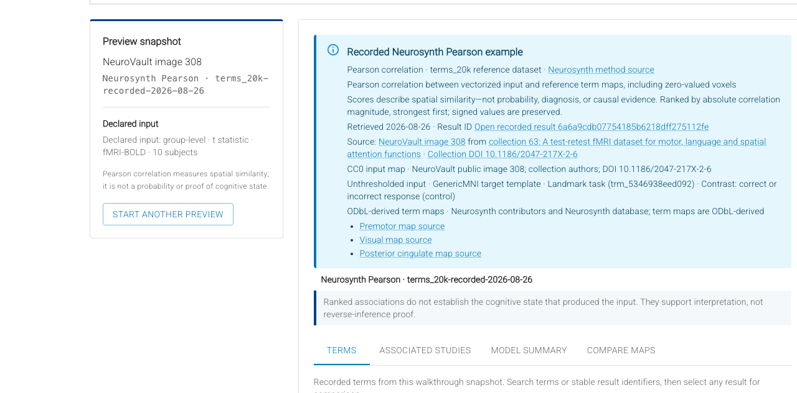
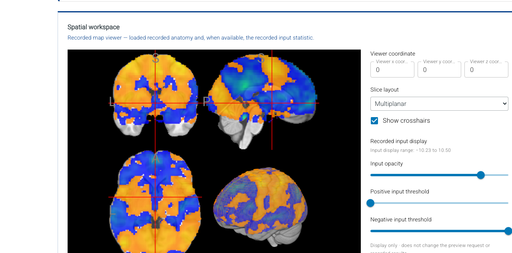
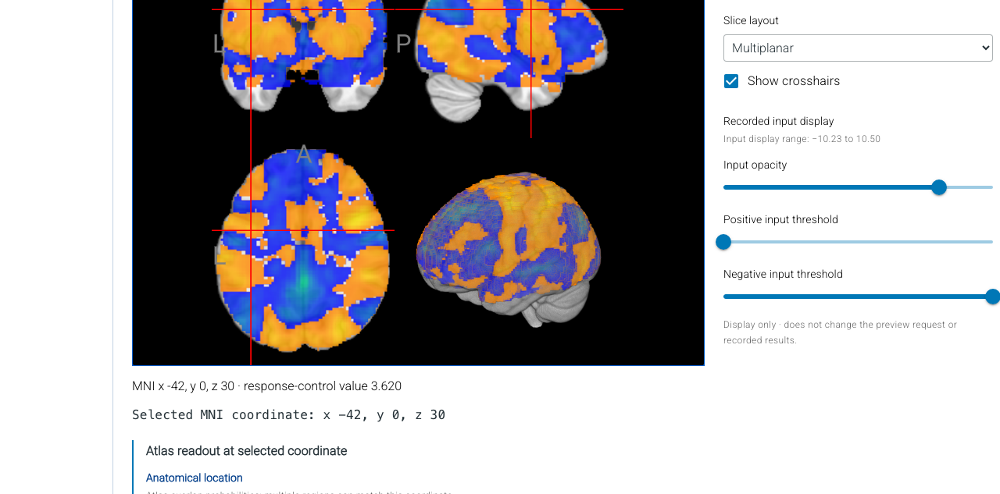
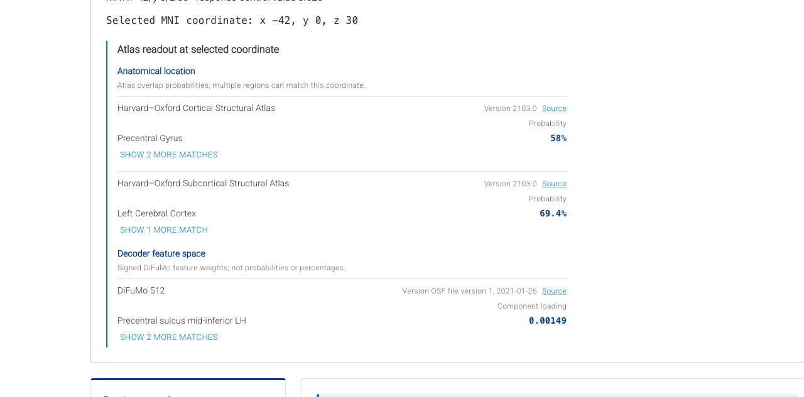
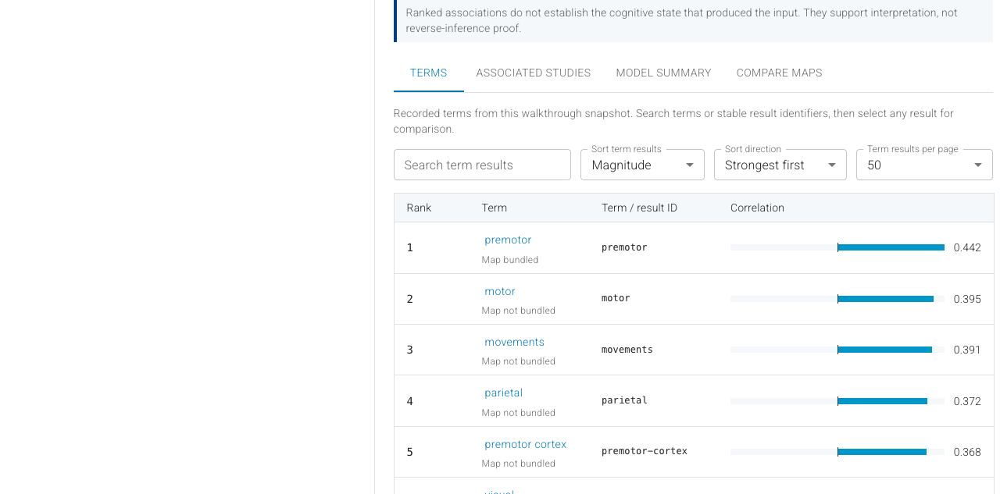
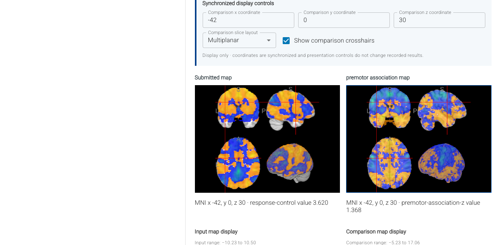
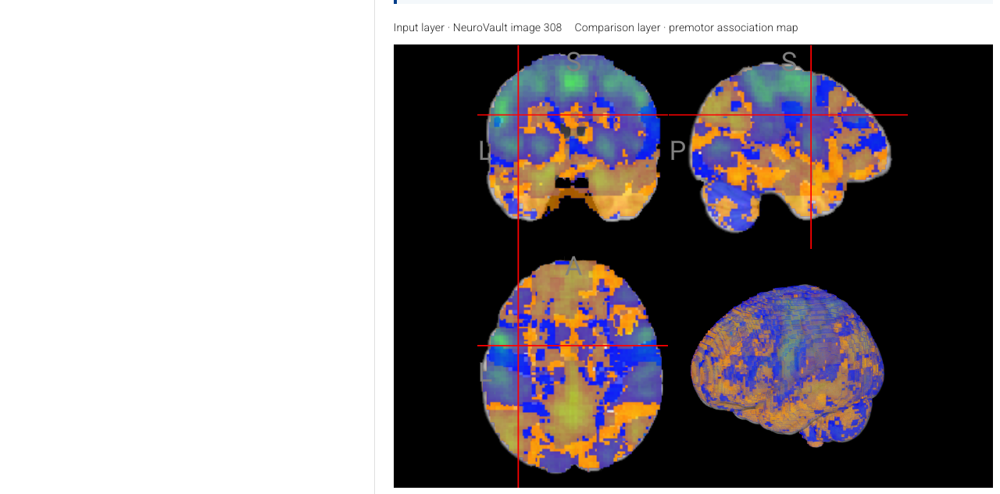
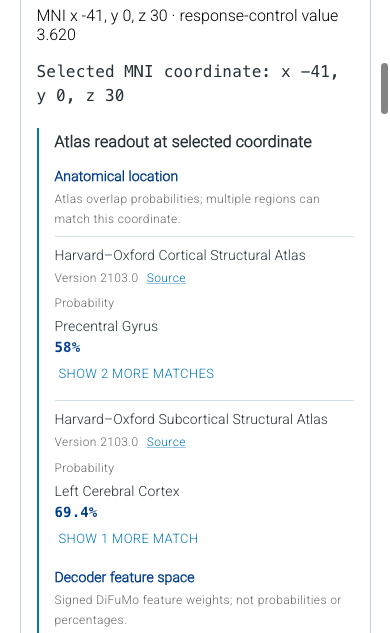

# Decoder interface walkthrough

Review evidence for [`enh/decoder-atlas-readout`](https://github.com/lobennett/neurostore/tree/enh/decoder-atlas-readout), captured from commit [`7b9a8ef6`](https://github.com/lobennett/neurostore/commit/7b9a8ef6f32f40e41b5435ea2fae2a3422bf1963) on August 28, 2026.

## Video walkthrough

[Watch or download the 58-second app-only MP4 walkthrough](./decoder-walkthrough.mp4).

The walkthrough opens the public NeuroVault image 308 example, inspects the submitted NIfTI, selects MNI coordinate −42, 0, 30 directly on the map, reviews the Harvard–Oxford and DiFuMo 512 readout, examines the recorded Neurosynth Pearson terms, and compares the submitted map with the premotor association map side by side and as an overlay. The recording contains only the public application—not the Cypress runner or command log.

## Still walkthrough

### 1. Recorded example and provenance

The interface clearly distinguishes the bundled, recorded Neurosynth Pearson example from a live decoder run and identifies NeuroVault image 308 and the `terms_20k` reference dataset.

### 2. Real submitted map

The spatial workspace renders the recorded input statistic over bundled MNI anatomy with synchronized coordinates and display-only controls.

### 3. Map selection flows into the atlas readout

Selecting MNI −42, 0, 30 directly on the canvas produces a real statistic value and places the selected coordinate immediately above the atlas readout.

### 4. Complete live atlas readout

The compact readout reports real Harvard–Oxford probabilities and signed DiFuMo feature loadings without repeating the coordinate.

### 5. Recorded decoding results

The terms table exposes signed Pearson correlations, stable identifiers, map availability, searching, and sorting.

### 6. Side-by-side comparison

The submitted NIfTI and the real premotor association map share coordinates, expose their sampled values, and retain independent display controls.

### 7. Overlay comparison

The overlay view combines the submitted and comparison maps with explicit layer labels, numeric values, and separate display settings.

### 8. Mobile coordinate-to-atlas layout

The sampled map value and selected coordinate lead directly into the atlas readout at a 390-pixel viewport. Labels, provenance, probabilities, and component loadings wrap without horizontal overflow.

## Evidence boundaries

- The input and comparison volumes are real, locally bundled NIfTI assets with recorded provenance.
- The term ranking is a recorded Neurosynth Pearson result; this branch does not claim to run a decoder backend.
- The atlas labels shown here came from the packaged local Harvard–Oxford and DiFuMo 512 service rather than test fixtures.
- The capture used the public `/decode?example=neurovault-308` route and required no login.
- Every displayed map value was sampled by interacting with its real NIfTI canvas before capture.
