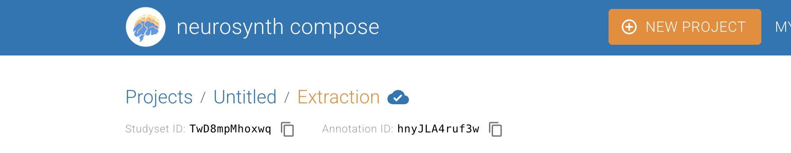

# Evidence — copyable studyset/annotation IDs (#1559)

Evidence for [neurostuff/neurostore#1559](https://github.com/neurostuff/neurostore/issues/1559).
The new `CopyableId` component surfaces the studyset-id and annotation-id with a one-click
copy button on the Extraction stage and the project Overview, so they can be pasted into
NiMARE to download the studyset/annotation directly. Before this change, those ids were not
surfaced for copy on these views.

## Live — Extraction page (real project)
Verified end-to-end on the full local stack: a project taken through curation → extraction
shows the ids in the header, and the copy buttons work.

## Copy interaction (isolated component demo)
Clicking the copy button copies the raw id and shows a "Copied!" confirmation.

