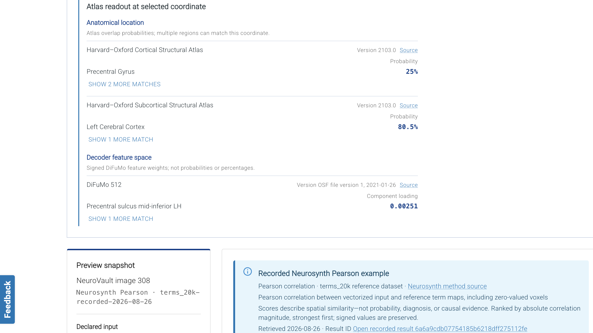
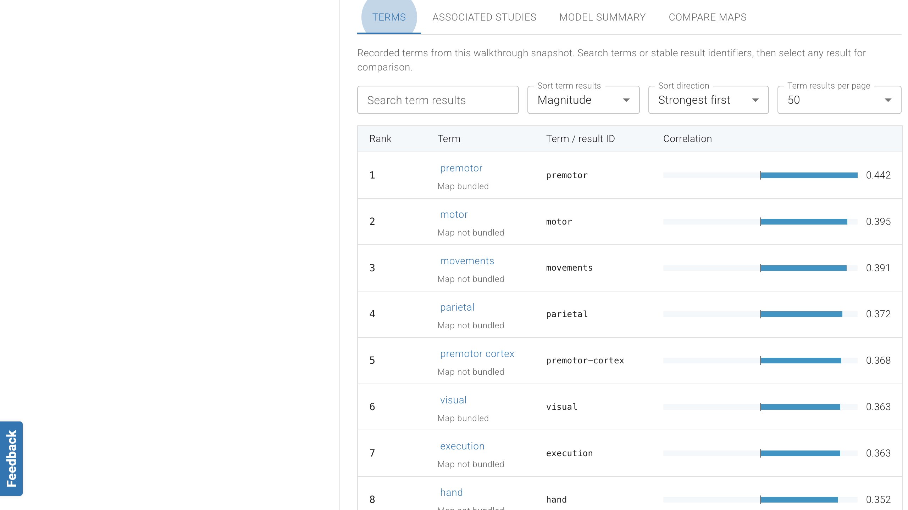
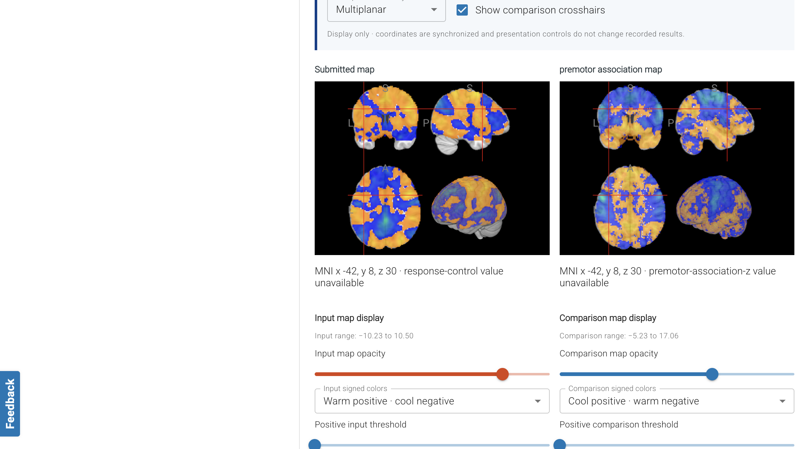
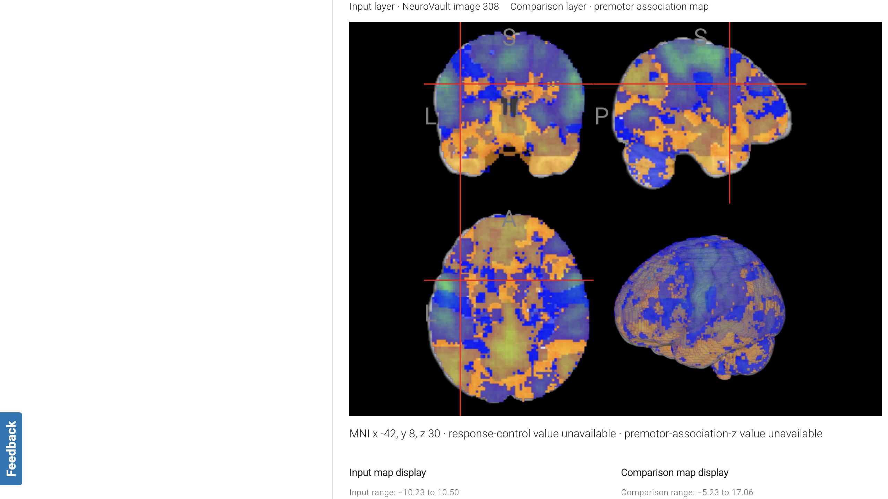
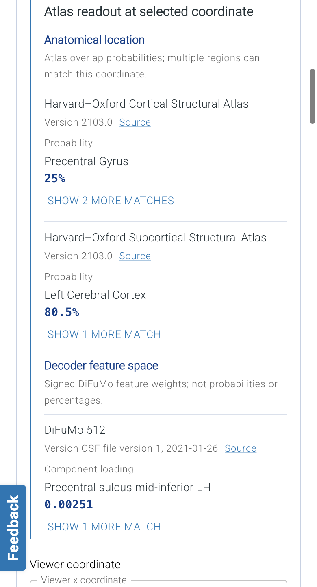

# Decoder interface walkthrough

Review evidence for [`enh/decoder-atlas-readout`](https://github.com/lobennett/neurostore/tree/enh/decoder-atlas-readout), captured from commit [`7b9a8ef6`](https://github.com/lobennett/neurostore/commit/7b9a8ef6f32f40e41b5435ea2fae2a3422bf1963) on August 28, 2026.

## Video walkthrough

[Watch or download the 57-second MP4 walkthrough](./decoder-walkthrough.mp4).

The walkthrough opens the public NeuroVault image 308 example, inspects the submitted NIfTI, moves to MNI coordinate −42, 8, 30, reviews the Harvard–Oxford and DiFuMo 512 readout, examines the recorded Neurosynth Pearson terms, and compares the submitted map with the premotor association map side by side and as an overlay.

## Still walkthrough

### 1. Recorded example and provenance

The interface clearly distinguishes the bundled, recorded Neurosynth Pearson example from a live decoder run and identifies NeuroVault image 308 and the `terms_20k` reference dataset.

### 2. Real submitted map

The spatial workspace renders the recorded input statistic over bundled MNI anatomy with synchronized coordinates and display-only controls.

### 3. Atlas readout at the selected coordinate

At MNI −42, 8, 30, the compact readout reports real Harvard–Oxford probabilities and signed DiFuMo feature loadings directly beneath the map coordinate.

### 4. Recorded decoding results

The terms table exposes signed Pearson correlations, stable identifiers, map availability, searching, and sorting.

### 5. Side-by-side comparison

The submitted NIfTI and the real premotor association map share coordinates while retaining independent display controls.

### 6. Overlay comparison

The overlay view combines the submitted and comparison maps with explicit layer labels and separate display settings.

### 7. Mobile atlas layout

The atlas readout retains its hierarchy and wraps labels, provenance, probabilities, and component loadings at a 390-pixel viewport.

## Evidence boundaries

- The input and comparison volumes are real, locally bundled NIfTI assets with recorded provenance.
- The term ranking is a recorded Neurosynth Pearson result; this branch does not claim to run a decoder backend.
- The atlas labels shown here came from the packaged local Harvard–Oxford and DiFuMo 512 service rather than test fixtures.
- The capture used the public `/decode?example=neurovault-308` route and required no login.
