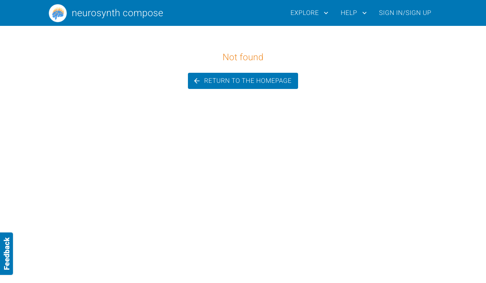
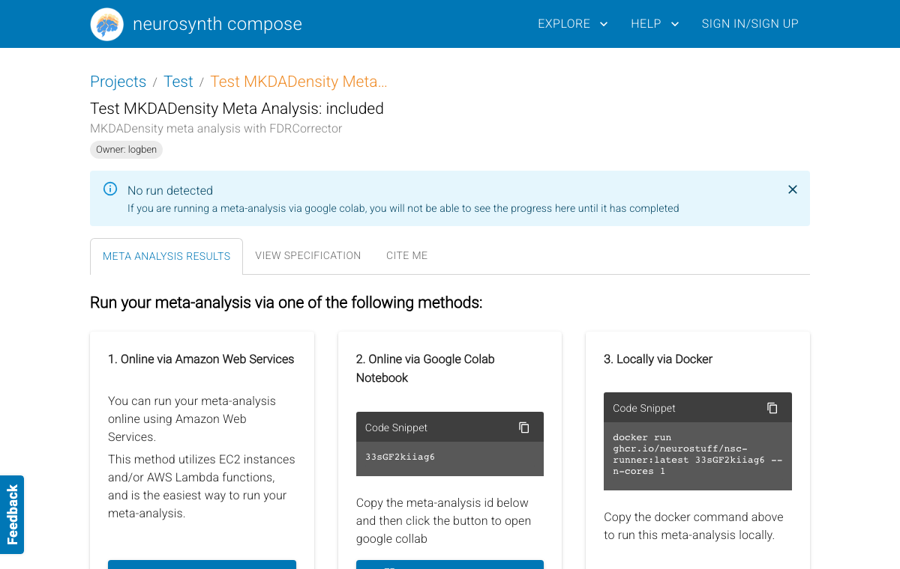

# Evidence — legacy meta-analysis URL redirect (#1564)

Evidence for [neurostuff/neurostore#1564](https://github.com/neurostuff/neurostore/issues/1564).
A project-less `/meta-analyses/:id` URL (written into NeuroVault by compose-runner) used to
404. The fix resolves it to the canonical project-scoped page. Verified live on the full local
stack against a real meta-analysis (`33sGF2kiiag6`, project `wuUuxSXTbw7Z`).

| | URL visited | Result |
|---|---|---|
| **before** | `/meta-analyses/33sGF2kiiag6` | "Not found" (no route → catch-all) |
| **after** | `/meta-analyses/33sGF2kiiag6` | redirects to `/projects/wuUuxSXTbw7Z/meta-analyses/33sGF2kiiag6` and renders the meta-analysis |

An invalid id (e.g. `/meta-analyses/doesnotexist999`) still correctly shows "Not found".

## before

## after

