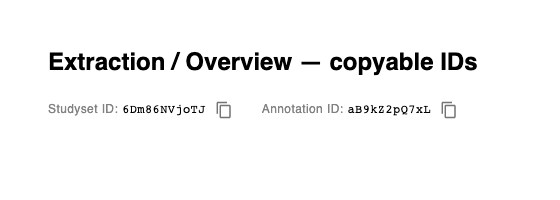

# Evidence — copyable studyset/annotation IDs (#1559)

Demo for [neurostuff/neurostore#1559](https://github.com/neurostuff/neurostore/issues/1559).
The new `CopyableId` component is rendered on the Extraction stage and the project
Overview, showing the studyset-id and annotation-id with a one-click copy button
(so they can be pasted into NiMARE to download the studyset/annotation directly).

Captured by mounting the real `CopyableId` component in an isolated Playwright harness
and clicking the copy button. Before this change, those IDs were not surfaced for copy
on these views.

