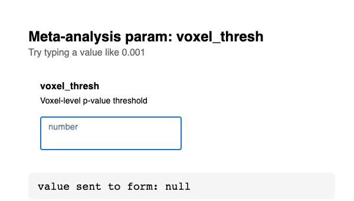

# Evidence — leading-zero / decimal entry in numeric params (#1387)

Live before/after for [neurostuff/neurostore#1387](https://github.com/neurostuff/neurostore/issues/1387).
Captured by mounting the real `DynamicFormNumericInput` component in an isolated
Playwright harness (through the project's Vite, so its MUI/alias deps resolve) and
typing `0.001` keystroke by keystroke.

| File | Version | Typing `0.001` produces |
|---|---|---|
| `before.gif` | `master` (`type="number"`, `value={props.value \|\| ''}`) | field collapses to **`1`** — the form receives the wrong value |
| `after.gif` | fix branch (`type="text"` + controlled string state) | **`0.001`** — the form receives the correct value |

## before

## after

